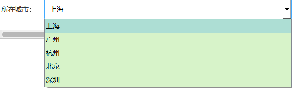

# qt-for-python 纯qss ui美化
## 样式总览
  

> tips:class、sizes等出现的均为qt中添加的自定义属性
## qtdesigner 自定义属性添加方法
  


## QLabel
  
```css
class="h1"
class="h2"
class="h3"
class="h4"
class="h5"
```

## QPushButton
  
1. 主要按钮
```css
class="primary"
```
2. 警告按钮
```css
class="warning"
```
3. 危险按钮
```css
class="danger"
```
4. 成功按钮
```css
class="success"
```
5. 大尺寸
```css
class="large"
```
6. 小尺寸
```css
class="mini"
```

## QLineEdit
  

## QTextEdit
  

## QSpinBox
  

## QComboBox
  

## QRadioButton
需要创建一个widget，然后设置
```css
class="radio"
```
然后再把QRadioButton放进去

  

## QCheckBox
需要创建一个widget，然后设置
```css
class="checkbox"
```
然后再把QCheckBox放进去

  

## QFormLayout
需要创建一个widget，然后设置
```css
class="form"
```

## 分页器
需要创建一个widget，然后设置
```css
class="pagination"
```
里的按钮自己在Qtdesiner里面加，如果要蓝色主题的，设置按钮的class="primary"即可

  

## QTableWidget
  

## QTabWidget
  

## Qss代码 
复制下面的代码到您的基础QSS文件中查看效果
```py
#centralwidget QLabel {
  color: #333333;
  font-size: 14px;
}
#centralwidget QLabel[class="h1"] {
  color: #333333;
  font-size: 28px;
}
#centralwidget QLabel[class="h2"] {
  color: #333333;
  font-size: 24px;
}
#centralwidget QLabel[class="h3"] {
  color: #333333;
  font-size: 20px;
}
#centralwidget QLabel[class="h4"] {
  color: #555555;
  font-size: 16px;
}
#centralwidget QLabel[class="h5"] {
  color: #777777;
}
#centralwidget QPushButton {
  font-size: 14px;
  background-color: #ffffff;
  border: 1px solid #d9d9d9;
  color: #555555;
  border-radius: 2px;
  height: 34px;
}
#centralwidget QPushButton:hover {
  border-color: #40a9ff;
  color: #40a9ff;
}
#centralwidget QPushButton:pressed {
  border-color: #096dd9;
  color: #096dd9;
}
#centralwidget QPushButton:disabled {
  background-color: #f5f5f5;
  color: #cccccc;
  border: 1px solid #d9d9d9;
}
#centralwidget QPushButton:checked {
  background-color: #1890ff;
  border: 1px solid #1890ff;
  color: #ffffff;
}
#centralwidget QPushButton[class="primary"] {
  background-color: #1890ff;
  border-color: #1890ff;
  color: #ffffff;
}
#centralwidget QPushButton[class="primary"]:hover {
  border-color: #40a9ff;
  background-color: #40a9ff;
}
#centralwidget QPushButton[class="primary"]:pressed {
  border-color: #096dd9;
  background-color: #096dd9;
}
#centralwidget QPushButton[class="primary"]:checked {
  border-color: #1890ff;
  background: #e6f7ff;
  color: #555555;
}
#centralwidget QPushButton[class="warning"] {
  background-color: #faad14;
  border-color: #faad14;
  color: #ffffff;
}
#centralwidget QPushButton[class="warning"]:hover {
  border-color: #fcb934;
  background-color: #fcb934;
}
#centralwidget QPushButton[class="warning"]:pressed {
  border-color: #e09704;
  background-color: #e09704;
}
#centralwidget QPushButton[class="warning"]:checked {
  border-color: #faad14;
  background: #f5e3c0;
  color: #555555;
}
#centralwidget QPushButton[class="success"] {
  background-color: #52c41a;
  border-color: #52c41a;
  color: #ffffff;
}
#centralwidget QPushButton[class="success"]:hover {
  border-color: #6bcf39;
  background-color: #6bcf39;
}
#centralwidget QPushButton[class="success"]:pressed {
  border-color: #3ba704;
  background-color: #3ba704;
}
#centralwidget QPushButton[class="success"]:checked {
  border-color: #52c41a;
  background: #d7f3c9;
  color: #555555;
}
#centralwidget QPushButton[class="danger"] {
  background-color: #ff4d4f;
  border-color: #ff4d4f;
  color: #ffffff;
}
#centralwidget QPushButton[class="danger"]:hover {
  border-color: #fc6e70;
  background-color: #fc6e70;
}
#centralwidget QPushButton[class="danger"]:pressed {
  border-color: #da2629;
  background-color: #da2629;
}
#centralwidget QPushButton[class="danger"]:checked {
  border-color: #ff4d4f;
  background: #f8c5c6;
  color: #555555;
}
#centralwidget QPushButton[sizes="large"] {
  height: 45px;
}
#centralwidget QPushButton[sizes="mini"] {
  height: 24px;
}
#centralwidget QPushButton[shape="circle"] {
  border-radius: 17px;
}
#centralwidget QLineEdit {
  border: 1px solid #d9d9d9;
  padding: 4px 11px;
  background: #ffffff;
  border-radius: 2px;
  height: 32px;
  font-size: 14px;
}
#centralwidget QLineEdit:hover {
  border-color: #40a9ff;
}
#centralwidget QLineEdit:focus {
  border-color: #1890ff;
}
#centralwidget QTextEdit {
  border: 1px solid #d9d9d9;
  padding: 4px 0 4px 11px;
  background: #ffffff;
  border-radius: 2px;
  font-size: 14px;
}
#centralwidget QTextEdit:hover {
  border-color: #40a9ff;
}
#centralwidget QTextEdit:focus {
  border-color: #1890ff;
}
#centralwidget QSpinBox,
#centralwidget QDoubleSpinBox,
#centralwidget QDateTimeEdit {
  border: 1px solid #d9d9d9;
  padding: 4px 11px;
  background: #ffffff;
  border-radius: 2px;
  height: 32px;
  font-size: 14px;
}
#centralwidget QSpinBox:hover,
#centralwidget QDoubleSpinBox:hover,
#centralwidget QDateTimeEdit:hover {
  border-color: #40a9ff;
}
#centralwidget QSpinBox:focus,
#centralwidget QDoubleSpinBox:focus,
#centralwidget QDateTimeEdit:focus {
  border-color: #1890ff;
}
#centralwidget QSpinBox::up-button,
#centralwidget QDoubleSpinBox::up-button,
#centralwidget QDateTimeEdit::up-button {
  width: 22px;
}
#centralwidget QSpinBox::down-button,
#centralwidget QDoubleSpinBox::down-button,
#centralwidget QDateTimeEdit::down-button {
  width: 22px;
}
#centralwidget QComboBox {
  border: 1px solid #d9d9d9;
  padding: 4px 11px;
  background: #ffffff;
  border-radius: 2px;
  height: 32px;
  font-size: 14px;
}
#centralwidget QComboBox:hover {
  border-color: #40a9ff;
}
#centralwidget QComboBox:focus {
  border-color: #1890ff;
}
#centralwidget QComboBox QAbstractItemView {
  background: #d7f3c9;
}
#centralwidget QComboBox QAbstractItemView::item {
  height: 20px;
  padding: 4px 0;
}
#centralwidget QWidget[class="radio"] {
  padding: 4px 11px;
  height: 32px;
}
#centralwidget QRadioButton {
  font-size: 14px;
}
#centralwidget QRadioButton::indicator {
  width: 14px;
  height: 14px;
}
#centralwidget QRadioButton::indicator:checked {
  width: 6px;
  height: 6px;
  border: 5px solid #1890ff;
  border-radius: 8px;
  background: #ffffff;
}
#centralwidget QRadioButton::indicator:unchecked {
  border: 1px solid #cccccc;
  border-radius: 8px;
}
#centralwidget QWidget[class="checkbox"] {
  padding: 4px 11px;
  height: 32px;
}
#centralwidget QCheckBox {
  font-size: 14px;
}
#centralwidget QCheckBox::indicator:unchecked {
  border: 1px solid #bbbbbb;
}
#centralwidget QWidget[class="form"] QLabel {
  height: 32px;
  padding: 4px 0;
}
#centralwidget QTableView {
  background-color: #ffffff;
  border: 1px solid #cccccc;
  border-radius: 2px;
  selection-background-color: qlineargradient(
    x1: 0,
    y1: 0,
    x2: 0.5,
    y2: 0.5,
    stop: 0 #eeeeee,
    stop: 1 #dddddd
  );
  selection-color: #000000;
  color: #555555;
  gridline-color: #eeeeee;
  font-size: 14px;
}
#centralwidget QHeaderView {
  color: #333333;
  font-size: 14px;
  border: none;
  min-height: 36px;
  background: #fafafa;
}
#centralwidget QHeaderView::section {
  color: #333333;
  background-color: #fafafa;
  border-top: 0 solid #cccccc;
  border-left: 0 solid #cccccc;
  border-right: 1px solid #cccccc;
  border-bottom: 1px solid #cccccc;
  selection-background-color: qlineargradient(
    x1: 0,
    y1: 0,
    x2: 0.5,
    y2: 0.5,
    stop: 0 #eeeeee,
    stop: 1 #dddddd
  );
  selection-color: #000000;
}
#centralwidget QTableView QTableCornerButton::section {
  background-color: #eeeeee;
  border-top: 0 solid #cccccc;
  border-left: 0 solid #cccccc;
  border-right: 1px solid #cccccc;
  border-bottom: 1px solid #cccccc;
}
#centralwidget QTabWidget::pane {
  border: 1px solid #cccccc;
  border-bottom-left-radius: 2px;
  border-bottom-right-radius: 2px;
  border-top-right-radius: 2px;
}
#centralwidget QTabBar::tab {
  background: #fafafa;
  border: 1px solid #cccccc;
  border-radius: 0;
  border-left: 0 solid #cccccc;
  padding: 10px 20px;
}
#centralwidget QTabBar::tab:first {
  border-left: 1px solid #cccccc;
  border-top-left-radius: 2px;
}
#centralwidget QTabBar::tab:last {
  border-top-right-radius: 2px;
}
#centralwidget QTabBar::tab:selected {
  background: #ffffff;
  border-bottom: none;
}
#centralwidget QTabBar::tab:hover {
  background: #ffffff;
}
#centralwidget QTabWidget::pane:top {
  top: -1px;
}
#centralwidget QTabWidget::pane:bottom {
  bottom: -1px;
}
#centralwidget QTabWidget::pane:left {
  right: -1px;
}
#centralwidget QTabWidget::pane:right {
  left: -1px;
}
#centralwidget QScrollArea {
  background: transparent;
  border: none;
}
#centralwidget QScrollArea > QWidget > QWidget {
  background: transparent;
}
#centralwidget QScrollBar::vertical {
  border-radius: 0;
  background: #f1f1f1;
  padding-top: 14px;
  padding-bottom: 14px;
}
#centralwidget QScrollBar::handle:vertical {
  background: #c1c1c1;
  border-radius: 5px;
  margin-left: 3px;
  margin-right: 3px;
}
#centralwidget QScrollBar::handle:vertical:hover {
  background: #b8b8b8;
  border-radius: 5px;
}
#centralwidget QScrollBar::add-line:vertical {
  height: 14px;
  width: 100%;
  background-image: url("");
  background: #ececec;
  subcontrol-position: bottom;
  subcontrol-origin: margin;
}
#centralwidget QScrollBar::sub-line:vertical {
  height: 14px;
  width: 100%;
  background-image: url("");
  background: #ececec;
  subcontrol-position: top;
  subcontrol-origin: margin;
}
#centralwidget QScrollBar::add-line:vertical:hover {
  height: 14px;
  width: 100%;
  background-image: url("");
  background: #c1c1c1;
}
#centralwidget QScrollBar::sub-line:vertical:hover {
  height: 14px;
  width: 100%;
  background-image: url("");
  background: #c1c1c1;
}
#centralwidget QScrollBar::add-page:vertical {
  background: #f1f1f1;
}
#centralwidget QScrollBar::sub-page:vertical {
  background: #f1f1f1;
}
#centralwidget QScrollBar::horizontal {
  border-radius: 0;
  background: #f1f1f1;
  padding-left: 14px;
  padding-right: 14px;
}
#centralwidget QScrollBar::handle:horizontal {
  background: #c1c1c1;
  border-radius: 5px;
  margin-top: 3px;
  margin-bottom: 3px;
}
#centralwidget QScrollBar::handle:horizontal:hover {
  background: #b8b8b8;
  border-radius: 5px;
}
#centralwidget QScrollBar::add-line:horizontal {
  height: 100%;
  width: 14px;
  background-image: url("");
  background: #ececec;
  subcontrol-position: right;
  subcontrol-origin: margin;
}
#centralwidget QScrollBar::sub-line:horizontal {
  height: 100%;
  width: 14px;
  background-image: url("");
  background: #ececec;
  subcontrol-position: left;
  subcontrol-origin: margin;
}
#centralwidget QScrollBar::add-line:horizontal:hover {
  height: 100%;
  width: 14px;
  background-image: url("");
  background: #c1c1c1;
}
#centralwidget QScrollBar::sub-line:horizontal:hover {
  height: 100%;
  width: 14px;
  background-image: url("");
  background: #c1c1c1;
}
#centralwidget QScrollBar::add-page:horizontal {
  background: #f1f1f1;
}
#centralwidget QScrollBar::sub-page:horizontal {
  background: #f1f1f1;
}
#centralwidget QWidget[class="pagination"] QPushButton {
  padding: 0 10px;
  color: #777777;
}
#centralwidget QWidget[class="pagination"] QPushButton[class="primary"] {
  padding: 0 10px;
  color: #ffffff;
}
#centralwidget QWidget[class="pagination"] QLabel {
  color: #777777;
}
#centralwidget QWidget[class="pagination"] QLineEdit {
  width: 36px;
  height: 26px;
}
```

## 定制主题
所有样式采用less编码 查看qss\index.less 
更改
```less
/* 下面是公共样式 */
//主要颜色
@primary: #1890ff;
@primary-light: #40a9ff;
@primary-deep: #096dd9;
@primary-selected: #e6f7ff;
//警告颜色
@warning: #faad14;
@warning-light: #fcb934;
@warning-deep: #e09704;
@warning-selected: #f5e3c0;
//危险颜色
@danger: #ff4d4f;
@danger-light: #fc6e70;
@danger-deep: #da2629;
@danger-selected: #f8c5c6;
//成功颜色
@success: #52c41a;
@success-light: #6bcf39;
@success-deep: #3ba704;
@success-selected: #d7f3c9;
```